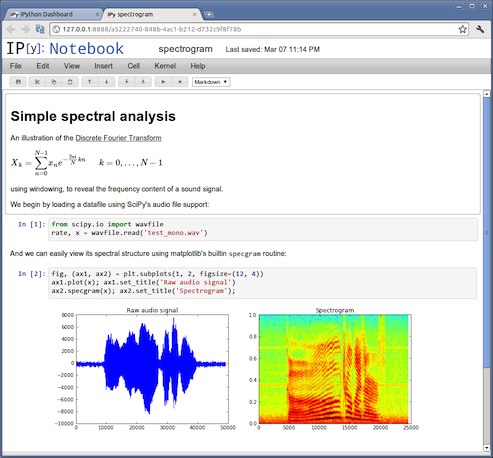

# IPython / Scipy tutorial

## Installation

### Conda / Anaconda

First we need nuts & bolts.

- Conda [[doc]](http://conda.pydata.org/docs) is a package manager application (``pip`` + ``venv`` + ``virtualenvwrapper``)
- Anaconda [[link]](https://www.continuum.io/downloads) is a Python distribution which include more than 300 of the most popular Python packages for science,
math, engineering, and data analysis.

Then we set up an environment for the tutorial:

	$ conda create -n tutopython python=3.4
	$ source activate tutopython

	
### Python packages

It's now time to install some packages :

	$ conda install ipython numpy scipy matplotlib

and you're ready to play with ipython's command line interface.

	$ ipython
	Python 3.4.3 |Continuum Analytics, Inc.| (default, Mar  6 2015, 12:07:41)
	Type "copyright", "credits" or "license" for more information.
	
	IPython 4.0.0 -- An enhanced Interactive Python.
	?         -> Introduction and overview of IPython's features.
	%quickref -> Quick reference.
	help      -> Python's own help system.
	object?   -> Details about 'object', use 'object??' for extra details.
	
	In [1]:	

But a more powerful environment is available to carry out exploratory computation and data analysis : notebooks.

## IPython notebooks

Notebooks are interactive computational environments, in which you can combine code execution, rich text, mathematics, plots and rich media. See <http://ipython.org/notebook.html>. 

 
 
Notebooks are stored as JSON files with a ``.ipynb`` extension.
 
 	$ conda install ipython-notebook
 	$ ipython notebook
	[I 09:30:28.237 NotebookApp] Using MathJax from CDN: https://cdn.mathjax.org/mathjax/latest/MathJax.js
	[I 09:30:29.031 NotebookApp] Serving notebooks from local directory: /Users/honnorat/Documents/YeastLab/tutopython
	[I 09:30:29.031 NotebookApp] 0 active kernels
	[I 09:30:29.032 NotebookApp] The IPython Notebook is running at: http://localhost:8888/
	[I 09:30:29.032 NotebookApp] Use Control-C to stop this server and shut down all kernels (twice to skip confirmation).
	[W 09:30:38.422 NotebookApp] Notebook tuto_filter.ipynb is not trusted
	[I 09:30:39.040 NotebookApp] Kernel started: ce530cd1-a559-4e8e-895c-c9543ea61f4f
	
Now you can open your browser at the given address <http://localhost:8888/> and create a new notebook.